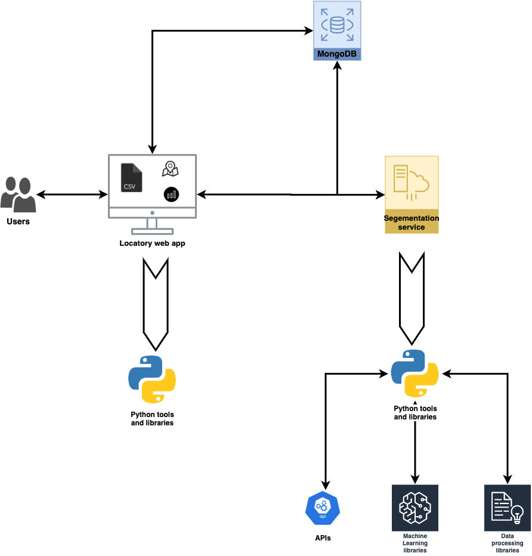

# envisage-insights
# Locatory

A customer segmentation tool, driven by AI and visualization!

### Deployed application URL
1) Access the locatory-app deployed on [GCP](https://locatory-k4j2diazgq-ue.a.run.app/). Please go to [README.MD](locatory-app/README.md) for test credentials.

### Local installation setup
1) Setup the [locatory-backend](locatory-backend) by following its [README.MD](locatory-backend/segmentation-service/README.md)
2) Setup the [locatory-web-application](locatory-app) by following its [README.MD](locatory-app/README.md)

### Screenshots

1) Locatory architecture
