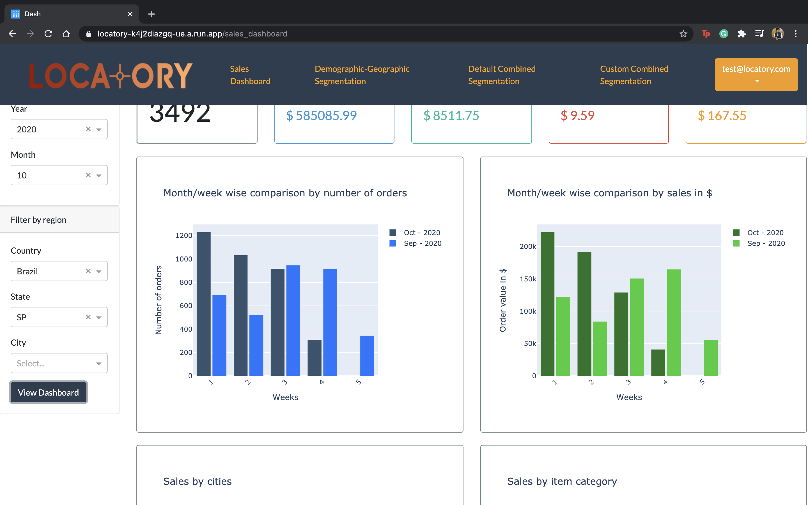

# envisage-insights
# Locatory

A customer segmentation tool, driven by AI and visualization!

### Deployed application URL
1) Access the locatory-app deployed on [GCP](https://locatory-k4j2diazgq-ue.a.run.app/). Please go to [README.MD](locatory-app/README.md) for test credentials.

### Local installation setup
1) Setup the [locatory-backend](locatory-backend) by following its [README.MD](locatory-backend/segmentation-service/README.md)
2) Setup the [locatory-web-application](locatory-app) by following its [README.MD](locatory-app/README.md)

### Screenshots

1) Locatory architecture

2) Locatory login

3) Sales-dashboard - stats, bar graphs

4) Sales-dashboard - bar graph-2

5) Sales-dashboard - pie chart

6) Sales-dashboard - pie chart-2

7) Sales-dashboard - density heatmap

8) Customer Demographic, Geographic filtering

9) Customer segments export to CSV

10) Customer segmentation using RFM

11) Customer segmentation using RFM

12) Create custom map

13) Create custom map - parameters

14) Customer segmentation using custom maps - near-real time RFM segmentation

